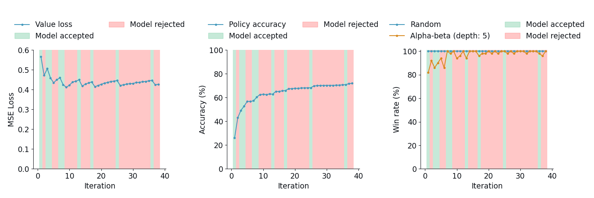
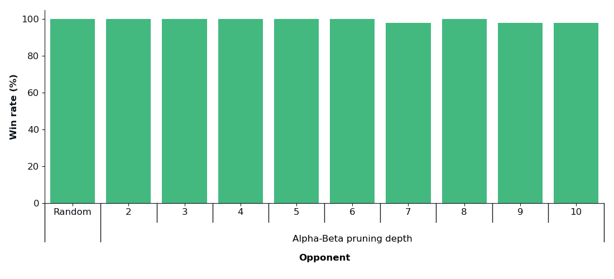

<div align="center">
<h1>ConnectZero</h1>
  
Implementing DeepMind’s AlphaZero model for Connect Four through a
combination of deep reinforcement learning and tree search algorithms
\
\
[**🎮 Demo** (works best on Chrome)](https://connect-zero.onrender.com/) 

</div>

## Installation

Create a conda environment with a name of your choice with Python version 3.12:


```shell
conda create -n [env_name] python=3.12
```

Activate it and install all necessary libraries:

```shell
pip install -r requirements.txt
```

### Playing against ConnectZero

To play against ConnectZero, use the following command:
```shell
python main.py --play [starter]
```

The `[starter]` parameter determines the starting player: `1` indicates that you start first, while `2` means you go second.


### Reproducing the Results

To reproduce the experiments discussed below, use the following command:

```shell
python main.py --experiment [n_games]
```

The `[n_games]` parameter (positive non-zero integer) specifies the number of games played during the
experiment. For fairness, an even number is recommended to ensure both 
players have an equal number of games in each half.

## Methodology

The following section offers a concise overview of the methodology used 
in the development of ConnectZero. 
It includes links to the relevant code and results for reference. 
While it highlights the key aspects of the approach, 
it is not intended to be exhaustive (please refer to the 
code for a complete and detailed overview).

### Model Development

#### Input Features

The input consists of a 3 $\times$ 6 $\times$ 7 tensor, where the last 
two dimensions refer to the 6 $\times$ 7 Connect Four board.
The three input channels are as follows:
- The first channel indicates the presence of player 1's pieces (1 for a piece, 0 otherwise).
- The second channel does the same for the pieces belonging to player 2.
- The third channel represents the current player’s turn, with all values set to 1 if it's player 1's turn and 0 if it's player 2's turn.

#### Hyperparameters

The following table shows the hyperparameter setup used, all of which were 
tuned manually.

<div align="center">
<table>
    <tr>
        <th rowspan="2">Category</th>
        <th rowspan="2">Hyperparameter</th>
        <th colspan="3">Phase</th>
    </tr>
    <tr>
        <th><a href="./brain/SelfPlay.py">Self-play</a></th>
        <th><a href="./brain/Evaluator.py">Evaluation</a></th>
        <th>Experimentation</th>
    </tr>
    <tr>
        <td rowspan="4"><a href="./brain/AlphaZero.py">Training loop</a></td>
        <td># iterations</td>
        <td colspan="3">75</td>
    </tr>
    <tr>
        <td># self-play episodes</td>
        <td>250</td>
        <td>-</td>
        <td>-</td>
    </tr>
    <tr>
        <td># evaluation games</td>
        <td>-</td>
        <td colspan="2">50</td>
    </tr>
    <tr>
        <td>Model acceptance rate</td>
        <td>-</td>
        <td>>0.55</td>
        <td>-</td>
    </tr>
    <tr>
        <td rowspan="5"><a href="./brain/MCTS.py">MCTS</a></td>
        <td># simulations</td>
        <td colspan="3">100</td>
    </tr>
    <tr>
        <td>Temperature</td>
        <td>1 (if # turn < 15) <br> 0 otherwise</td>
        <td colspan="2">0</td>
    </tr>
    <tr>
        <td>$c_{puct}$</td>
        <td colspan="3">2</td>
    </tr>
    <tr>
        <td>Dirichlet $\alpha$</td>
        <td>0.5</td>
        <td colspan="2">0</td>
    </tr>
    <tr>
        <td>Dirichlet $\epsilon$</td>
        <td>0.25</td>
        <td colspan="2">0</td>
    </tr>
    <tr>
        <td rowspan="4"><a href="./models/DualResidualNetwork.py">Network</a></td>
        <td>Type</td>
        <td colspan="3">ResNet</td>
    </tr>
    <tr>
        <td># blocks</td>
        <td colspan="3">5</td>
    </tr>
    <tr>
        <td># filters</td>
        <td colspan="3">128</td>
    </tr>
    <tr>
        <td>Dropout probability</td>
        <td>0.3</td>
        <td>-</td>
        <td>-</td>
    </tr>
    <tr>
        <td rowspan="3"><a href="./models/DualResidualNetwork.py">Learning</a></td>
        <td># epochs</td>
        <td>10</td>
        <td>-</td>
        <td>-</td>
    </tr>
    <tr>
        <td>Learning rate</td>
        <td>10<sup>-3</sup></td>
        <td>-</td>
        <td>-</td>
    </tr>
    <tr>
        <td>Weight decay</td>
        <td>10<sup>-3</sup></td>
        <td>-</td>
        <td>-</td>
    </tr>
</table>
</div>

### Results

#### Training

After [training for all iterations](./logs/saved), a total of 989,012 state-policy-reward triplets were
collected with 688,125 unique state-reward pairs. There were 13 occassions where
the new model was accepted.

The following plots illustrate the value loss, policy accuracy, 
and win rate across all iterations, evaluated against both a random 
and an alpha-beta pruning opponent.

<div align="center">
<picture>
    <source media="(prefers-color-scheme: dark)" srcset="./experiment/plots/loss_accuracy_winrate_curves_dark.png">
    
</picture>
</div>

Notably, the value loss exhibits a choppy pattern, suggesting that 
the model struggles to generalize as new data is introduced in each 
iteration. One possible explanation is that the number of MCTS 
simulations is insufficient for thorough exploration, leading to 
high-variance training data. Alternatively, the learning rate or 
number of training epochs might be too low to enable effective 
convergence.

Despite this, the policy accuracy remains relatively stable, although 
likely due to the inherent robustness of accuracy as a metric compared to 
loss. Similarly, the win rate against both opponents tends to stabilize 
over time, albeit to a lesser extent.

#### Benchmarking

The following shows the [benchmarking results](./experiment/logs/saved) against a [random opponent](./strategy/RandomStrategy.py) and an 
[alpha-beta pruning opponent](./strategy/AlphaBetaPruningStrategy.py) across various search depths. The reward function used for the 
alpha-beta pruning is +1 for a win and -1 for a loss (vice versa for the minimizing player).
The hyperparameters for ConnectZero remain the same as those used during training.

<div align="center">
<picture>
    <source media="(prefers-color-scheme: dark)" srcset="./experiment/plots/benchmark_results_plot_dark.png">
    
</picture>
</div>

Overall, ConnectZero performs strongly with close to a 100% win rate across 
all opponents. The few recorded losses occur exclusively in the second half, when ConnectZero is at a disadvantage due to starting second.


# References

Below are list of resources that I consulted to build ConnectZero:

- Paper: [Mastering Chess and Shogi by Self-Play with a General Reinforcement Learning Algorithm](https://arxiv.org/abs/1712.01815)
- Paper: [Mastering the Game of Go without Human Knowledge](https://discovery.ucl.ac.uk/id/eprint/10045895/1/agz_unformatted_nature.pdf)
- Repository: [alpha-zero-general](https://github.com/suragnair/alpha-zero-general/tree/master) - helped with implementing MCTS and parts of the model network + game logic.
- Repository: [AlphaZero.jl](https://jonathan-laurent.github.io/AlphaZero.jl/dev/tutorial/connect_four/) - helped provide some initial insight into which hyperparameters might be effective.
- Repository: [Connect4](https://github.com/AbdallahReda/Connect4/blob/master/minimaxAlphaBeta.py) - helped with implementing the alpha-beta pruning opponent.