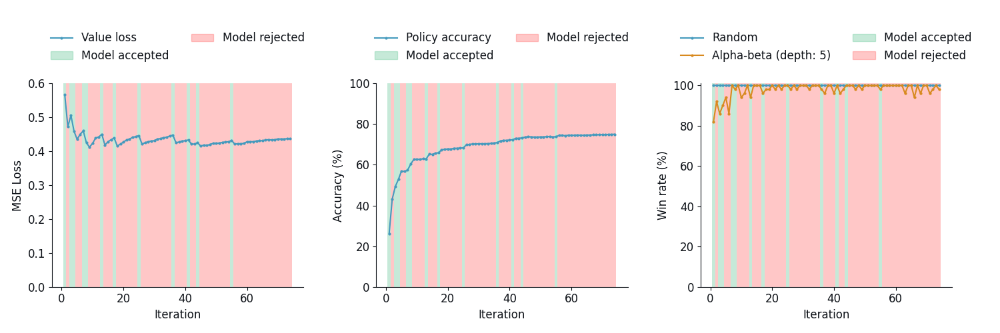

<h1>ConnectZero</h1>
  
An adaptation to DeepMind’s AlphaZero model for Connect Four through a
combination of deep reinforcement learning and tree search algorithms
\
\
[**🎮 Demo** (works best on Chrome)](https://connect-zero.onrender.com/) 

## Installation

[WORK IN PROGRESS]

## Methodology

The following section offers a concise overview of the methodology used 
in the development of ConnectZero. 
It includes links to the relevant code and results for reference. 
While it highlights the key aspects of the approach, 
it is not intended to be exhaustive (please refer to the 
code for a complete and detailed overview).

### Model Development

#### Input Features

The input consists of a 3 $\times$ 6 $\times$ 7 tensor, where the last 
two dimensions refer to the 6 $\times$ 7 Connect Four board.
The three input channels are as follows:
- The first channel indicates the presence of player 1's pieces (1 for a piece, 0 otherwise).
- The second channel does the same for the pieces belonging to player 2.
- The third channel represents the current player’s turn, with all values set to 1 if it's player 1's turn and 0 if it's player 2's turn.

#### Hyperparameters

The following table shows the hyperparameter setup used, all of which were 
tuned manually.

<table>
    <tr>
        <th rowspan="2">Category</th>
        <th rowspan="2">Hyperparameter</th>
        <th colspan="3">Phase</th>
    </tr>
    <tr>
        <th><a href="./brain/SelfPlay.py">Self-play</a></th>
        <th><a href="./brain/Evaluator.py">Evaluation</a></th>
        <th>Experimentation</th>
    </tr>
    <tr>
        <td rowspan="4"><a href="./brain/AlphaZero.py">Training loop</a></td>
        <td># iterations</td>
        <td colspan="3">80</td>
    </tr>
    <tr>
        <td># self-play episodes</td>
        <td>250</td>
        <td>-</td>
        <td>-</td>
    </tr>
    <tr>
        <td># evaluation games</td>
        <td>-</td>
        <td colspan="2">50</td>
    </tr>
    <tr>
        <td>Model acceptance rate</td>
        <td>-</td>
        <td>>0.55</td>
        <td>-</td>
    </tr>
    <tr>
        <td rowspan="5"><a href="./brain/MCTS.py">MCTS</a></td>
        <td># simulations</td>
        <td colspan="3">100</td>
    </tr>
    <tr>
        <td>Temperature</td>
        <td>1 (if # turn < 15)   0 otherwise</td>
        <td colspan="2">0</td>
    </tr>
    <tr>
        <td>$c_{puct}$</td>
        <td colspan="3">2</td>
    </tr>
    <tr>
        <td>Dirichlet $\alpha$</td>
        <td>0.5</td>
        <td colspan="2">0</td>
    </tr>
    <tr>
        <td>Dirichlet $\epsilon$</td>
        <td>0.25</td>
        <td colspan="2">0</td>
    </tr>
    <tr>
        <td rowspan="4"><a href="./models/DualResidualNetwork.py">Network</a></td>
        <td>Type</td>
        <td colspan="3">ResNet</td>
    </tr>
    <tr>
        <td># blocks</td>
        <td colspan="3">5</td>
    </tr>
    <tr>
        <td># filters</td>
        <td colspan="3">128</td>
    </tr>
    <tr>
        <td>Dropout probability</td>
        <td>0.3</td>
        <td>-</td>
        <td>-</td>
    </tr>
    <tr>
        <td rowspan="3"><a href="./models/DualResidualNetwork.py">Learning</a></td>
        <td># epochs</td>
        <td>10</td>
        <td>-</td>
        <td>-</td>
    </tr>
    <tr>
        <td>Learning rate</td>
        <td>10-3</td>
        <td>-</td>
        <td>-</td>
    </tr>
    <tr>
        <td>Weight decay</td>
        <td>10-3</td>
        <td>-</td>
        <td>-</td>
    </tr>
</table>

### Results

#### Training

The following plots illustrate the value loss, policy accuracy, 
and win rate across all iterations, evaluated against both a random 
and an alpha-beta pruning opponent.

<picture>
    <source media="(prefers-color-scheme: dark)" srcset="./experiment/plots/loss_accuracy_winrate_curves_dark.png">
    
</picture>

Notably, the value loss exhibits a choppy pattern, suggesting that 
the model struggles to generalize as new data is introduced in each 
iteration. One possible explanation is that the number of MCTS 
simulations is insufficient for thorough exploration, leading to 
high-variance training data. Alternatively, the learning rate or 
number of training epochs might be too low to enable effective 
convergence.

Despite this, the policy accuracy remains relatively stable, although 
likely due to the inherent robustness of accuracy as a metric compared to 
loss. Similarly, the win rate against both opponents tends to stabilize 
over time, albeit to a lesser extent.

#### Benchmarking

[WORK IN PROGRESS]
